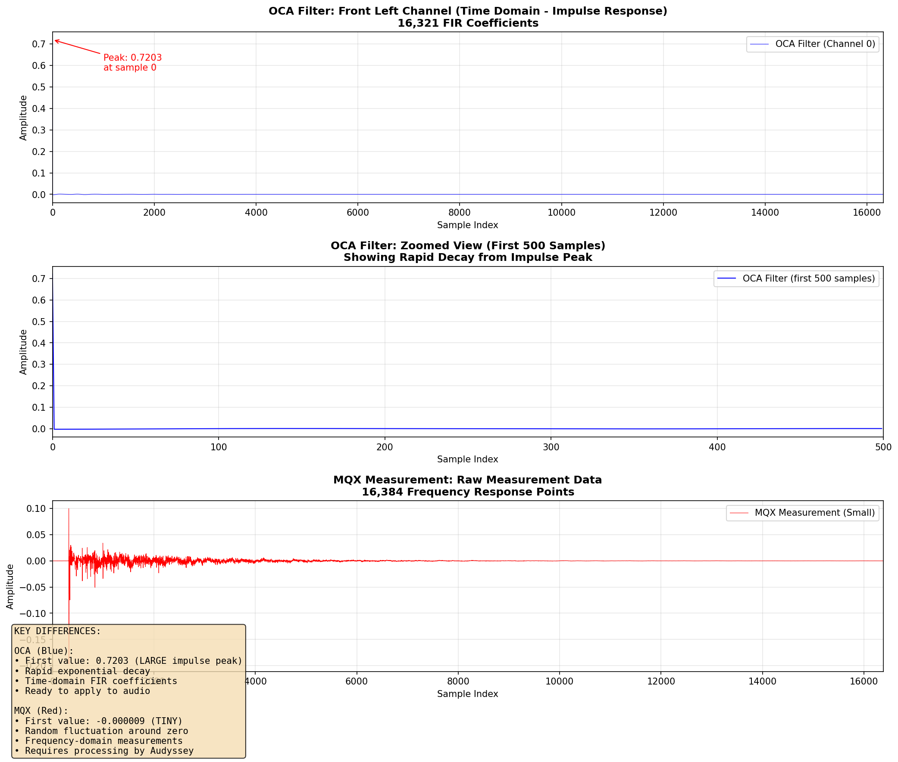

# OCA vs MultEQ-X vs ADY File Format Comparison

## Executive Summary

**OCA**, **MultEQ-X (MQX)**, and **ADY** files are all JSON-based formats used in the Audyssey ecosystem, but they contain fundamentally different types of data:

- **OCA files**: Processed **FIR filter coefficients** (ready to apply)
- **MQX/ADY files**: Raw **measurement data** (requires processing)

## How to Tell the Difference: Visual Inspection

### FIR Filter Coefficients (OCA Format)

**Characteristics:**
- ✅ First value is **LARGE** (~0.5 to 1.5) - this is the peak of the impulse response
- ✅ Values **decay rapidly** toward zero
- ✅ Later values are very small (< 0.001)
- ✅ Clear exponential decay pattern
- ✅ This is **TIME-DOMAIN** data

**Example from actual OCA file:**
```json
{
  "filter": [
    0.720278,    // ← LARGE peak at start (impulse peak)
    -0.002282,   // ← Immediately much smaller
    -0.002277,
    -0.002271,
    -0.002264,
    -0.002256,
    -0.002247,
    -0.002238,
    -0.002227,
    -0.002216,
    ...continues decaying...
    // By sample 1000: values < 0.0001
    // By sample 5000: values < 0.00001
  ]
}
```

**Statistics:**
- Total points: **16,321** (small speakers) or **16,055** (large speakers)
- Value range: **-0.0023 to 0.7203**
- Mean absolute value: **0.000116**
- Peak at index: **0** (always at the start)

### Raw Measurements (MQX/ADY Format)

**Characteristics:**
- ✅ **ALL values are small** (~10⁻⁵ to 10⁻³)
- ✅ **No obvious peak** at the start
- ✅ Values **fluctuate around zero**
- ✅ No clear decay pattern
- ✅ This is **FREQUENCY-DOMAIN** or raw response data

**Example from actual MQX file:**
```json
{
  "Data": "ktWttQTNDT..." // ← Base64-encoded, but when decoded:
  // Decoded as float32 array:
  [
    -0.000001295,  // ← Small, fluctuating values
     0.000033808,
    -0.000010557,
     0.000013592,
     0.000004731,
    -0.000018378,
     0.000008339,
     0.000039668,
     0.000010912,
     0.000003716,
    ...continues fluctuating...
    // No clear pattern or decay
  ]
}
```

**Statistics:**
- Total points: **16,384**
- Value range: **-0.001133 to 0.000895**
- Mean absolute value: **0.000089**
- Peak location: **No clear peak** (values distributed throughout)

## Complete Format Comparison Table

| Feature | OCA (A1 Evo Express) | MQX (MultEQ-X) | ADY (MultEQ Editor) |
|---------|---------------------|----------------|---------------------|
| **File Format** | JSON | JSON with base64 data | JSON with base64 data |
| **Data Type** | FIR filter coefficients | Raw measurements | Raw measurements |
| **Data Points** | 16,321 or 16,055 | 16,384 | 16,384 |
| **Domain** | Time-domain (impulse) | Frequency response | Frequency response |
| **First Value** | **0.5-1.5** (large) | **~10⁻⁵** (tiny) | **~10⁻⁵** (tiny) |
| **Value Range** | -0.003 to 1.5 | -0.002 to 0.001 | -0.002 to 0.001 |
| **Pattern** | Exponential decay | Random fluctuation | Random fluctuation |
| **Target Curves** | ❌ Not stored | ✅ Yes | ✅ Yes |
| **Ready to Use** | ✅ Yes (apply directly) | ❌ Needs processing | ❌ Needs processing |
| **Mic Positions** | ❌ Not stored | ✅ Multiple positions | ✅ Multiple positions |
| **Speaker Settings** | ✅ Yes (distance, trim) | ✅ Yes | ✅ Yes |
| **Encoding** | Plain JSON floats | Base64 float32 | Base64 float32 |

## Detailed Format Breakdown

### OCA File Structure

```json
{
  "A1EvoExpress": "2.0",
  "model": "AVR-X3800H",
  "channels": [
    {
      "speakerType": "S",
      "distanceInMeters": 3.05,
      "trimAdjustmentInDbs": 0,
      "filter": [/* 16,321 float values */],
      "filterLV": [/* 16,321 float values */],
      "commandId": 0,
      "xover": {
        "freq": 80,
        "slope": 24
      }
    }
  ]
}
```

**Key Points:**
- `filter`: Main FIR filter for normal listening
- `filterLV`: Low-volume variant (for Dynamic EQ)
- **16,321 taps** for small speakers (`type: "S"`)
- **16,055 taps** for large/effect speakers (`type: "E"`)
- Filters are **time-domain impulse responses**

### MQX File Structure

```json
{
  "_measurements": [
    {
      "Enabled": false,
      "Data": "base64_encoded_16384_floats...",
      "SystemDelay": 0.0,
      "AvrSpeakerType": "Subwoofer",
      "AvrDistanceMeters": 6.42,
      "AvrTrim": -12.0,
      "ChannelGuid": "guid-here",
      "PositionGuid": "guid-here"
    }
  ],
  "TargetCurveSet": [
    {
      "Name": "Filters for Front Left",
      "Channels": ["channel-guid"],
      "ApplyToFlat": true
    }
  ],
  "CalibrationSettings": {...}
}
```

**Key Points:**
- Multiple measurements (one per mic position)
- Each measurement: **16,384 frequency response points**
- Target curves specify desired frequency response shape
- **Not actual filters** - requires Audyssey processing

### ADY File Structure

Similar to MQX, but from the MultEQ Editor mobile app:
- JSON format with base64-encoded measurement data
- 16,384 data points per measurement
- Multiple mic positions
- Can be edited to create "perfect speaker" calibrations

## Target Curves in Your MQX File

Your MQX file contains **8 target curves**:

1. **Dolby Elevation**, 1. **Filters for Front Left**, 1. **Filters for Front Right**, 1. **Filters for Surround Back Left**, 1. **Filters for Surround Back Right**, 1. **Filters for Front Height Left**, 1. **Filters for Surround Back Right**, 1. **Filters for LFE**

**Important:** Despite names like "Filters for Front Left", these are **NOT actual filters**. They are target curve assignments that tell Audyssey:
- Which frequency response shape to aim for
- Which channels to apply the curve to
- Whether to apply to flat response or reference curve

## Why the Difference Matters

### OCA Files (Processed Filters)
1. **Ready to use** - Can be loaded directly into receiver
2. **Optimized length** - Truncated to necessary filter length
3. **Time-domain** - Represents how the speaker should respond over time
4. **No measurement data** - Can't see what the room response was

### MQX/ADY Files (Raw Measurements)
1. **Requires processing** - Must be converted to filters by Audyssey
2. **Full measurement** - Contains all 16,384 frequency bins
3. **Frequency-domain** - Represents what the mic heard at each frequency
4. **Editable** - Can modify target curves, measurements before processing

## Practical Examples

### Example 1: Identifying an Unknown File

**File contains:**
```json
[0.891234, -0.001234, -0.001198, -0.001156, ...]
```
**Answer:** OCA file (FIR filter) - large first value, rapid decay

**File contains:**
```json
[0.000012, -0.000034, 0.000056, -0.000023, ...]
```
**Answer:** MQX/ADY file (raw measurement) - all small values

### Example 2: Converting Between Formats

**MQX → OCA**: ❌ **Not possible directly**
- Requires Audyssey's proprietary processing algorithm
- Must use A1 Evo Express app to generate OCA from measurements

**OCA → MQX**: ❌ **Not possible**
- OCA contains only final filters, not original measurements
- Can't reconstruct room response from filters alone

**Magic Beans WAV → OCA**: ✅ **Possible** (this project)
- Magic Beans exports 65,536-tap FIR filters
- Can truncate to 16,321 taps for OCA
- Direct time-domain → time-domain conversion

## Detection Algorithm

```python
def detect_file_type(data_array):
    """
    Detect if data is FIR filter coefficients or raw measurements.
    
    Args:
        data_array: List or array of float values
        
    Returns:
        "FIR_FILTER" or "RAW_MEASUREMENT"
    """
    if len(data_array) < 10:
        return "UNKNOWN"
    
    # Check first value magnitude
    first_value = abs(data_array[0])
    
    # Check average of first 100 values
    avg_first_100 = sum(abs(v) for v in data_array[:100]) / 100
    
    if first_value > 0.3:
        # Large first value suggests FIR filter (impulse peak)
        return "FIR_FILTER"
    elif avg_first_100 < 0.001:
        # All small values suggest raw measurement
        return "RAW_MEASUREMENT"
    else:
        return "UNKNOWN"
```

## Visual Comparison: OCA vs MQX Data

Below is a side-by-side comparison of actual data from your files:



### Data Statistics

**OCA Filter (Channel 0 - Front Left):**
- Length: 16,321 samples
- First value: **0.720278** ← Large impulse peak
- Value range: -0.002282 to 0.720278
- Mean: 0.000044
- Standard deviation: 0.005642
- **Pattern**: Clear exponential decay from peak

**MQX Measurement (Small Speaker):**
- Length: 16,384 samples
- First value: **-0.000009** ← Tiny fluctuation
- Value range: -0.196174 to 0.099867
- Mean: 0.000001
- Standard deviation: 0.003638
- **Pattern**: Random fluctuation around zero

### What the Plots Show

1. **Top Plot (OCA Filter - Full View)**
   - Shows all 16,321 samples of the Front Left FIR filter
   - Large spike at sample 0 (impulse peak = 0.720278)
   - Rapid decay to near-zero within ~500 samples
   - Remaining samples contain fine detail but very small magnitudes

2. **Middle Plot (OCA Filter - Zoomed)**
   - First 500 samples showing the impulse decay
   - Classic FIR filter shape: sharp peak followed by oscillating decay
   - After peak, values quickly drop to < 0.01

3. **Bottom Plot (MQX Measurement)**
   - Raw measurement data from MultEQ-X
   - No obvious peak or pattern
   - All values are very small (< 0.2)
   - This represents what the microphone captured in the room

## Summary

**To distinguish OCA from MQX/ADY files:**

1. **Quick visual check**: Look at first value
   - Large (>0.3)? → FIR filter (OCA)
   - Tiny (<0.001)? → Raw measurement (MQX/ADY)

2. **Pattern check**: Look at overall pattern
   - Clear decay? → FIR filter
   - Random fluctuation? → Raw measurement

3. **File structure**: Check JSON keys
   - Has `"filter"` and `"filterLV"`? → OCA
   - Has `"_measurements"` and `"TargetCurveSet"`? → MQX/ADY

**MQX files DO contain target curves**, but these specify desired frequency response shapes, not actual filters. The actual filter generation is done by Audyssey's processing engine.

---

*Document created from analysis of actual files:*
- *OCA: A1EvoExpress_v2_Oct14_1933.oca*
- *MQX: Unknown_09-28-2025_0913AM.mqx*
