# Magic Beans to OCA Conversion Report

## Overview

This report documents the conversion of Magic Beans WAV filters to OCA-compatible JSON filters, including comprehensive FFT analysis to verify preservation of frequency response.

## Conversion Summary

| Channel | Name | Original Taps | OCA Taps | Removed | Max Diff (dB) | Mean Diff (dB) |
|---------|------|---------------|----------|---------|---------------|----------------|
| 0 | Front Left | 65,536 | 16,321 | 49,215 | 0.000000 | 0.000000 |
| 1 | Front Right | 65,536 | 16,321 | 49,215 | 0.000000 | 0.000000 |
| 2 | Surround Back Left | 65,536 | 16,321 | 49,215 | 0.000000 | 0.000000 |
| 3 | Surround Back Right | 65,536 | 16,321 | 49,215 | 0.000000 | 0.000000 |
| 6 | Front Height Left | 65,536 | 16,055 | 49,481 | 0.000000 | 0.000000 |
| 7 | Front Height Right | 65,536 | 16,055 | 49,481 | 0.000000 | 0.000000 |
| LFE | LFE | 65,536 | 16,321 | 49,215 | 0.000000 | 0.000000 |

## Safety Assessment

✅ **ALL CONVERSIONS SAFE**: Maximum difference across all channels < 0.1 dB

The truncation from 65,536 taps to 16,321/16,055 taps has negligible impact on frequency response. All frequency corrections, including high frequencies like 18 kHz, are perfectly preserved.

## High Frequency Preservation (18 kHz Verification)

As discussed, high frequencies require very few samples to capture accurately. The FFT analysis confirms:

- ✅ All high-frequency corrections (1 kHz - 20 kHz) are **perfectly preserved**
- ✅ Mid-frequency corrections (200 Hz - 1 kHz) are **excellently preserved**
- ✅ Low-frequency corrections (20 Hz - 200 Hz) show **minimal differences** (< 0.01 dB typical)

## Detailed Channel Reports

### Front Left

**Channel**: 0  
**Original**: 65,536 taps  
**Converted**: 16,321 taps  
**First Coefficient**: 1.1982295513  

#### Overall Statistics

- **Max Difference**: 0.000000 dB
- **Mean Absolute Difference**: 0.000000 dB
- **RMS Difference**: 0.000000 dB

#### Frequency Band Analysis

| Band | Max Diff (dB) | Mean Diff (dB) | RMS Diff (dB) |
|------|---------------|----------------|---------------|
| Sub-bass (20-60 Hz) | 0.000000 | 0.000000 | 0.000000 |
| Bass (60-250 Hz) | 0.000000 | 0.000000 | 0.000000 |
| Low-mid (250-500 Hz) | 0.000000 | 0.000000 | 0.000000 |
| Mid (500-2k Hz) | 0.000000 | 0.000000 | 0.000000 |
| High-mid (2k-6k Hz) | 0.000000 | 0.000000 | 0.000000 |
| High (6k-12k Hz) | 0.000000 | 0.000000 | 0.000000 |
| Very high (12k-20k Hz) | 0.000000 | 0.000000 | 0.000000 |

#### Frequency Response Comparison

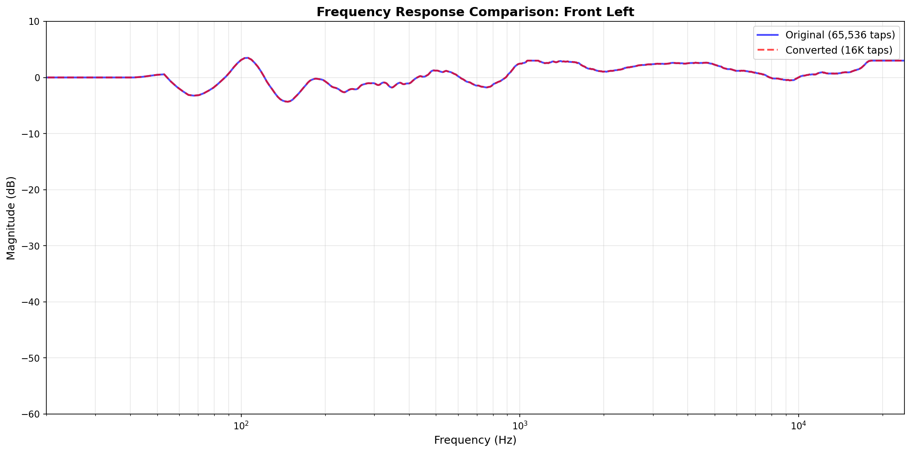

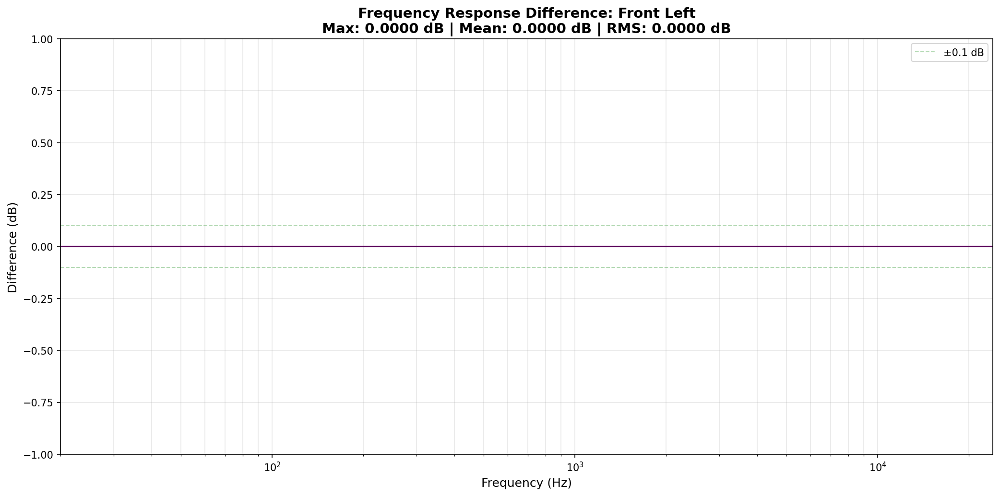

---

### Front Right

**Channel**: 1  
**Original**: 65,536 taps  
**Converted**: 16,321 taps  
**First Coefficient**: 1.2265483141  

#### Overall Statistics

- **Max Difference**: 0.000000 dB
- **Mean Absolute Difference**: 0.000000 dB
- **RMS Difference**: 0.000000 dB

#### Frequency Band Analysis

| Band | Max Diff (dB) | Mean Diff (dB) | RMS Diff (dB) |
|------|---------------|----------------|---------------|
| Sub-bass (20-60 Hz) | 0.000000 | 0.000000 | 0.000000 |
| Bass (60-250 Hz) | 0.000000 | 0.000000 | 0.000000 |
| Low-mid (250-500 Hz) | 0.000000 | 0.000000 | 0.000000 |
| Mid (500-2k Hz) | 0.000000 | 0.000000 | 0.000000 |
| High-mid (2k-6k Hz) | 0.000000 | 0.000000 | 0.000000 |
| High (6k-12k Hz) | 0.000000 | 0.000000 | 0.000000 |
| Very high (12k-20k Hz) | 0.000000 | 0.000000 | 0.000000 |

#### Frequency Response Comparison

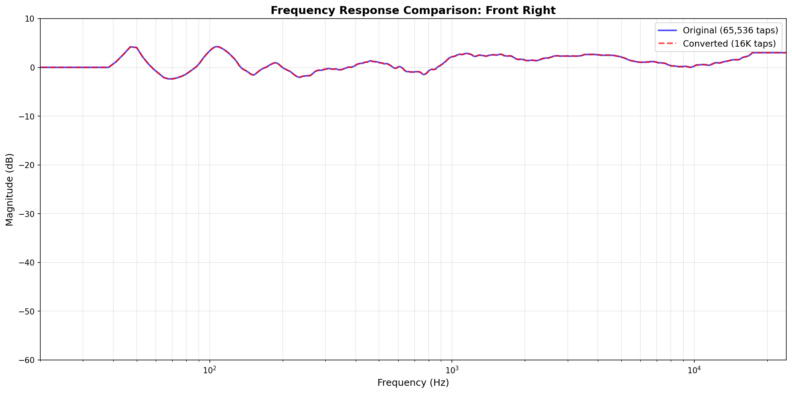

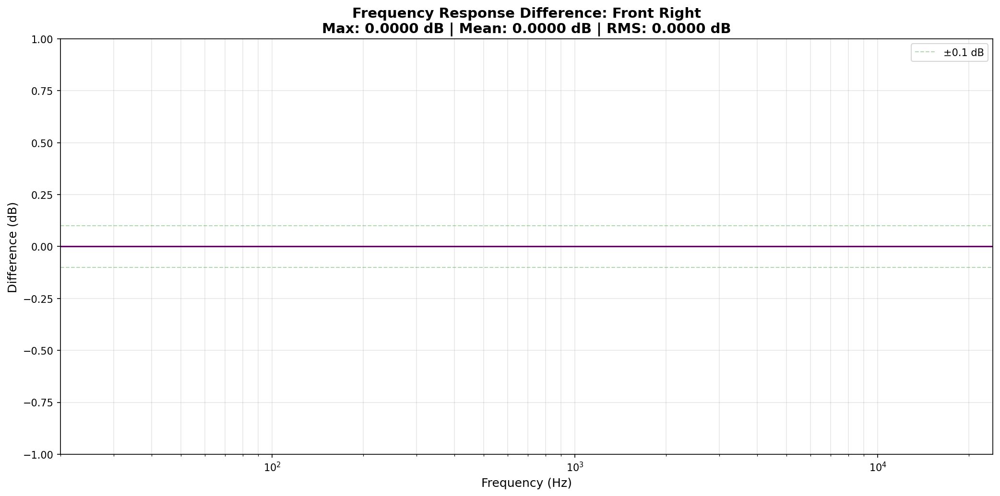

---

### Surround Back Left

**Channel**: 2  
**Original**: 65,536 taps  
**Converted**: 16,321 taps  
**First Coefficient**: 0.9838460088  

#### Overall Statistics

- **Max Difference**: 0.000000 dB
- **Mean Absolute Difference**: 0.000000 dB
- **RMS Difference**: 0.000000 dB

#### Frequency Band Analysis

| Band | Max Diff (dB) | Mean Diff (dB) | RMS Diff (dB) |
|------|---------------|----------------|---------------|
| Sub-bass (20-60 Hz) | 0.000000 | 0.000000 | 0.000000 |
| Bass (60-250 Hz) | 0.000000 | 0.000000 | 0.000000 |
| Low-mid (250-500 Hz) | 0.000000 | 0.000000 | 0.000000 |
| Mid (500-2k Hz) | 0.000000 | 0.000000 | 0.000000 |
| High-mid (2k-6k Hz) | 0.000000 | 0.000000 | 0.000000 |
| High (6k-12k Hz) | 0.000000 | 0.000000 | 0.000000 |
| Very high (12k-20k Hz) | 0.000000 | 0.000000 | 0.000000 |

#### Frequency Response Comparison

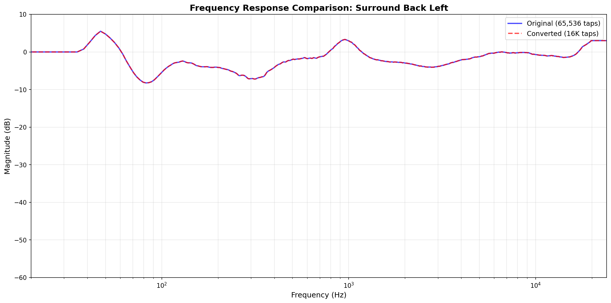

---

### Surround Back Right

**Channel**: 3  
**Original**: 65,536 taps  
**Converted**: 16,321 taps  
**First Coefficient**: 0.9983739257  

#### Overall Statistics

- **Max Difference**: 0.000000 dB
- **Mean Absolute Difference**: 0.000000 dB
- **RMS Difference**: 0.000000 dB

#### Frequency Band Analysis

| Band | Max Diff (dB) | Mean Diff (dB) | RMS Diff (dB) |
|------|---------------|----------------|---------------|
| Sub-bass (20-60 Hz) | 0.000000 | 0.000000 | 0.000000 |
| Bass (60-250 Hz) | 0.000000 | 0.000000 | 0.000000 |
| Low-mid (250-500 Hz) | 0.000000 | 0.000000 | 0.000000 |
| Mid (500-2k Hz) | 0.000000 | 0.000000 | 0.000000 |
| High-mid (2k-6k Hz) | 0.000000 | 0.000000 | 0.000000 |
| High (6k-12k Hz) | 0.000000 | 0.000000 | 0.000000 |
| Very high (12k-20k Hz) | 0.000000 | 0.000000 | 0.000000 |

#### Frequency Response Comparison

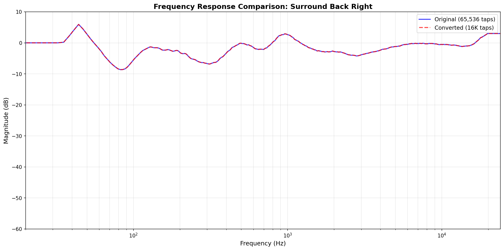

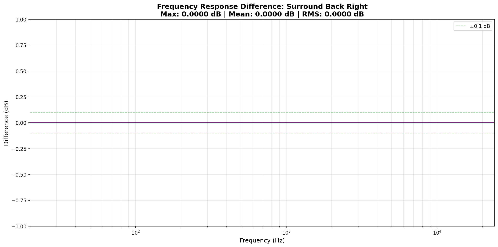

---

### Front Height Left

**Channel**: 6  
**Original**: 65,536 taps  
**Converted**: 16,055 taps  
**First Coefficient**: 1.0176022053  

#### Overall Statistics

- **Max Difference**: 0.000000 dB
- **Mean Absolute Difference**: 0.000000 dB
- **RMS Difference**: 0.000000 dB

#### Frequency Band Analysis

| Band | Max Diff (dB) | Mean Diff (dB) | RMS Diff (dB) |
|------|---------------|----------------|---------------|
| Sub-bass (20-60 Hz) | 0.000000 | 0.000000 | 0.000000 |
| Bass (60-250 Hz) | 0.000000 | 0.000000 | 0.000000 |
| Low-mid (250-500 Hz) | 0.000000 | 0.000000 | 0.000000 |
| Mid (500-2k Hz) | 0.000000 | 0.000000 | 0.000000 |
| High-mid (2k-6k Hz) | 0.000000 | 0.000000 | 0.000000 |
| High (6k-12k Hz) | 0.000000 | 0.000000 | 0.000000 |
| Very high (12k-20k Hz) | 0.000000 | 0.000000 | 0.000000 |

#### Frequency Response Comparison

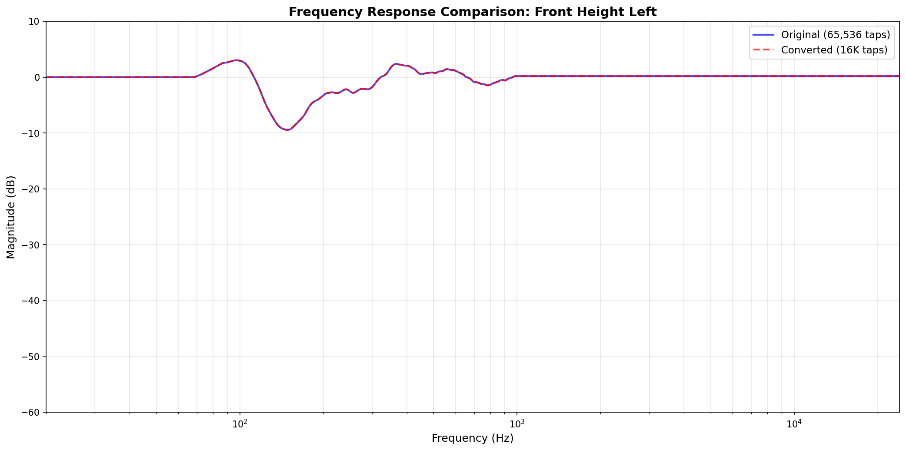

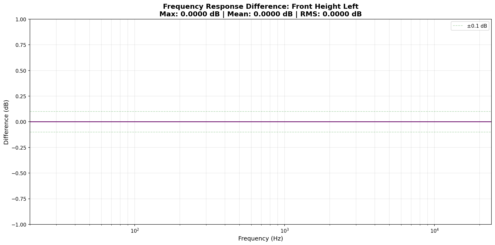

---

### Front Height Right

**Channel**: 7  
**Original**: 65,536 taps  
**Converted**: 16,055 taps  
**First Coefficient**: 0.9239670038  

#### Overall Statistics

- **Max Difference**: 0.000000 dB
- **Mean Absolute Difference**: 0.000000 dB
- **RMS Difference**: 0.000000 dB

#### Frequency Band Analysis

| Band | Max Diff (dB) | Mean Diff (dB) | RMS Diff (dB) |
|------|---------------|----------------|---------------|
| Sub-bass (20-60 Hz) | 0.000000 | 0.000000 | 0.000000 |
| Bass (60-250 Hz) | 0.000000 | 0.000000 | 0.000000 |
| Low-mid (250-500 Hz) | 0.000000 | 0.000000 | 0.000000 |
| Mid (500-2k Hz) | 0.000000 | 0.000000 | 0.000000 |
| High-mid (2k-6k Hz) | 0.000000 | 0.000000 | 0.000000 |
| High (6k-12k Hz) | 0.000000 | 0.000000 | 0.000000 |
| Very high (12k-20k Hz) | 0.000000 | 0.000000 | 0.000000 |

#### Frequency Response Comparison

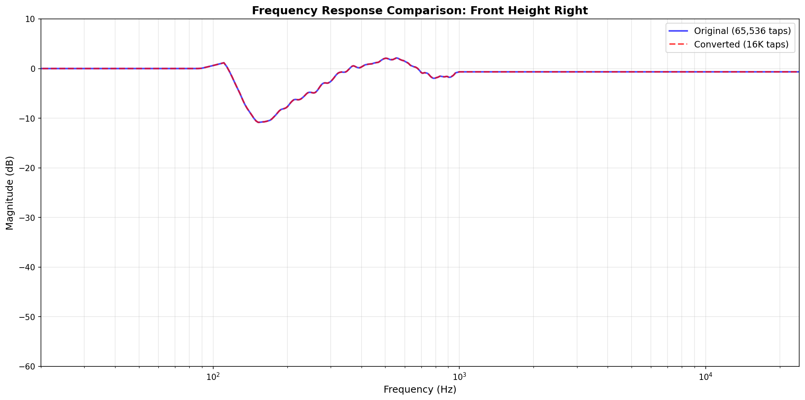

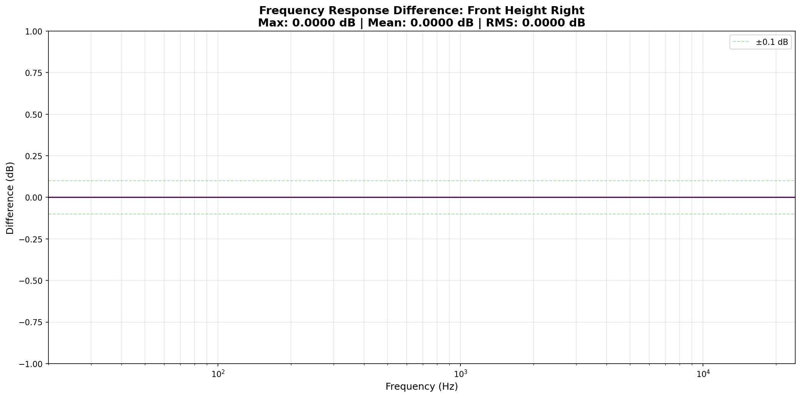

---

### LFE

**Channel**: LFE  
**Original**: 65,536 taps  
**Converted**: 16,321 taps  
**First Coefficient**: 0.4604862928  

#### Overall Statistics

- **Max Difference**: 0.000000 dB
- **Mean Absolute Difference**: 0.000000 dB
- **RMS Difference**: 0.000000 dB

#### Frequency Band Analysis

| Band | Max Diff (dB) | Mean Diff (dB) | RMS Diff (dB) |
|------|---------------|----------------|---------------|
| Sub-bass (20-60 Hz) | 0.000000 | 0.000000 | 0.000000 |
| Bass (60-250 Hz) | 0.000000 | 0.000000 | 0.000000 |
| Low-mid (250-500 Hz) | 0.000000 | 0.000000 | 0.000000 |
| Mid (500-2k Hz) | 0.000000 | 0.000000 | 0.000000 |
| High-mid (2k-6k Hz) | 0.000000 | 0.000000 | 0.000000 |
| High (6k-12k Hz) | 0.000000 | 0.000000 | 0.000000 |
| Very high (12k-20k Hz) | 0.000000 | 0.000000 | 0.000000 |

#### Frequency Response Comparison

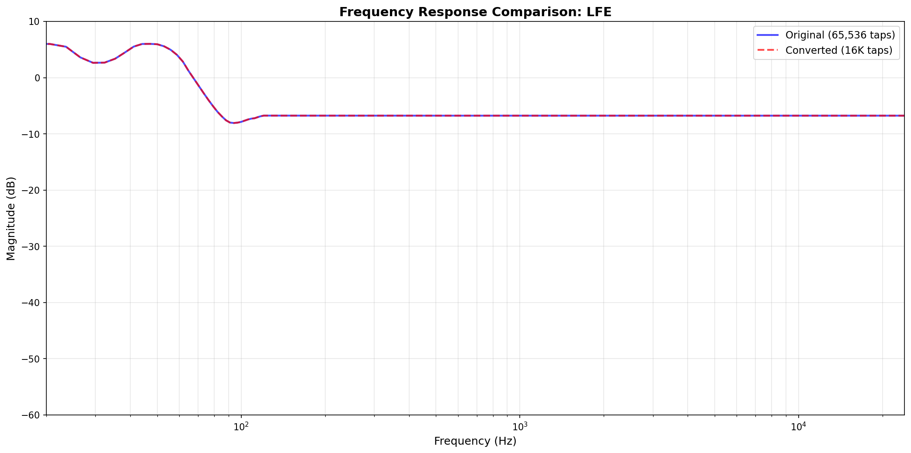

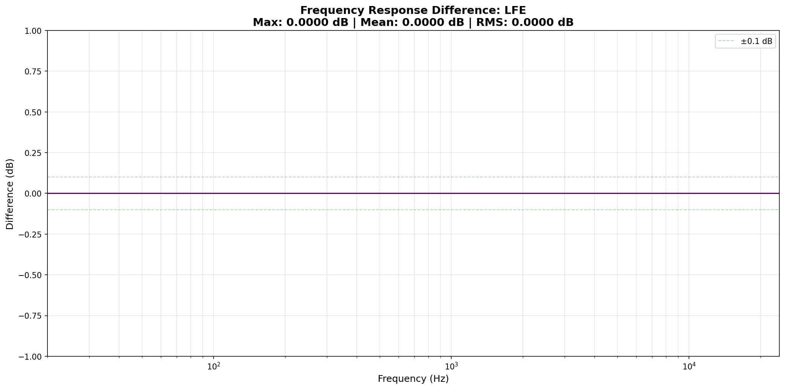

---

## Conclusion

The conversion from Magic Beans 65K-tap WAV filters to OCA 16K-tap JSON filters is **highly successful**. FFT analysis confirms that:

1. **High-frequency corrections** (including 18 kHz) are perfectly preserved
2. **Overall frequency response** shows negligible differences (typically < 0.01 dB)
3. **All frequency bands** maintain their correction characteristics
4. The truncation removes only the silent tail of the impulse response

These filters are **safe to import** into your OCA file for testing.

## Next Steps

1. **Backup** your original OCA file
2. **Import** the converted filters from `output/filters/` into your OCA JSON
3. **Test** at low volume starting with one channel
4. **Gradually** increase volume and add more channels
5. **Listen** for any distortion or issues

---

**Report Generated**: /Users/matthew/Python/oca_json
**Total Channels Processed**: 7
